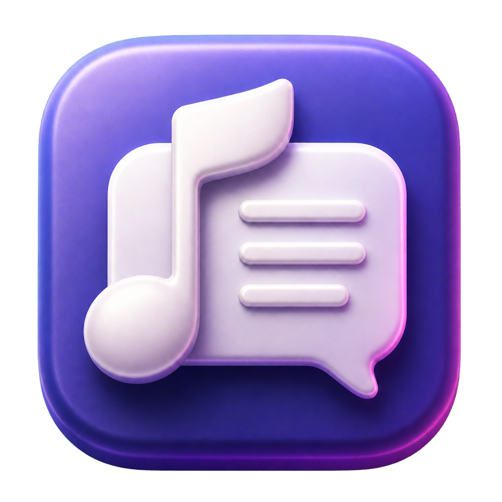

<p align="center">
  
</p>

# Myujigu

 

A native menu-bar app that keeps synchronized lyrics visible while you listen in Spotify, Apple Music, browsers, and other macOS media players.

```sh
open Myujigu.xcodeproj
```

- Keeps the active lyric in the macOS menu bar
- Shows album artwork from Spotify and Apple Music in the player panel
- Scrolls long lyric lines automatically
- Shows full, synchronized lyrics in a compact popover
- Includes previous, play/pause, and next controls
- Supports Spotify Desktop and Apple Music natively
- Follows other apps that publish playback metadata to macOS Now Playing
- Uses camera-safe lyric lanes on MacBooks with a notch
- Lets each side independently use automatic safe sizing or a fixed width from the center or notch
- Optionally highlights the current word using synchronized lyric timing, with provider word timing when available
- Reads cached lyrics first and keeps Spotify credentials in Keychain
- Written in Swift and SwiftUI
- macOS 13+

## How it works

Myujigu follows Spotify and Apple Music through macOS Automation and reads their own synchronized lyric sources. For other players, it reads the active macOS Now Playing session through MediaRemote and requests matching lyrics from LRCLIB using the track title, artist, album, and duration. When Spotify has no lyrics or only plain lyrics, Myujigu also checks LRCLIB for a synchronized match. This fallback requires exact normalized title, artist, and album metadata plus a duration within two seconds; when Spotify has plain lyrics, their text is compared locally before LRCLIB timing is accepted.

For Spotify cache misses, open the music-note menu-bar item, select the gear, and choose **Sign In with Spotify**. The login runs in a temporary isolated web view; Myujigu stores only the resulting `sp_dc` session cookie in macOS Keychain and sends it only to Spotify.

For a new Apple Music track that has not been cached yet, open the track's Lyrics view in Music. Myujigu checks the local cache again every three seconds.

## Permissions

- **Automation** — required to read playback state and control Spotify or Music.
- **Accessibility** — optional; used to measure the available menu-bar space beside the camera housing. Without it, Myujigu safely uses the right lyric lane only.

Realtime Karaoke does not record system audio or require Speech Recognition or Dictation. It follows provider word timing when available and otherwise estimates word timing within each synchronized line locally.

Media players other than Spotify and Music do not require Automation permission, but they must publish useful title and artist metadata to macOS Now Playing. Universal player support uses Apple's private MediaRemote framework and is intended for direct distribution rather than the Mac App Store.

Permissions can be changed in **System Settings → Privacy & Security**.

## Development

Requirements: macOS 13 or newer and Xcode.

Open `Myujigu.xcodeproj`, select the **Myujigu → My Mac** scheme, and press Run. Use
**Product → Test** for the `MyujiguCoreTests` suite and **Product → Archive** to
create an Xcode archive.

The Swift package remains available for command-line development:

```sh
make run
make test
```

Myujigu is an agent-style app, so it does not create a Dock icon or a normal app window.

Local builds and archives use **Sign to Run Locally** and are not notarized. Select
your Apple Developer team under **Signing & Capabilities** before distribution.

## Contributions

Contributions are welcome. For focused fixes or improvements, open a pull request with the smallest practical change. Please open an issue before starting work that changes the user experience or expands the app's scope.
